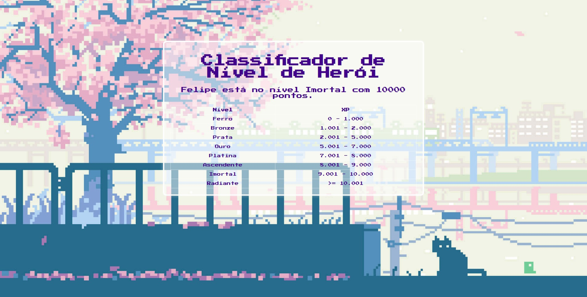
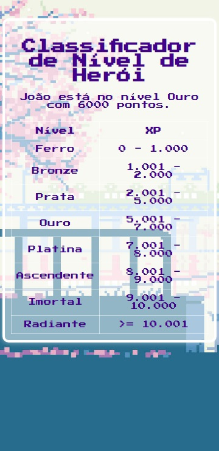

# DIO - Creating Games with Godot - Hero Level Classifier

## Project Challenge
This project is a simple web application that allows users to classify a hero's level based on their experience points (XP). It prompts the user to enter the hero's name and XP, then determines the hero's level using a predefined set of thresholds. The result is displayed on the webpage along with a table showing the classification criteria.

## Technologies Used
- HTML
- CSS
- JavaScript

## Features
- User input for hero's name and XP.
- Classification of hero's level based on XP.
- Display of result on the webpage.
- Responsive design for various screen sizes.

## Files
- `index.html`: HTML file containing the structure of the webpage.
- `style.css`: CSS file containing styles for the webpage, including retro game-inspired design.
- `script.js`: JavaScript file containing the logic to classify the hero's level and display the result.

## How to Use
1. Open the `index.html` file in a web browser.
2. Enter the hero's name and XP when prompted.
3. The webpage will display the hero's level along with classification criteria in a retro game-inspired design.

## Screenshots
PC Mode

Mobile phone mode

Tablet mode

## Possible Improvements
- Allow users to select different themes.
- Allow history annd comparison mode.
- Implement user authentication for personalized experiences.
